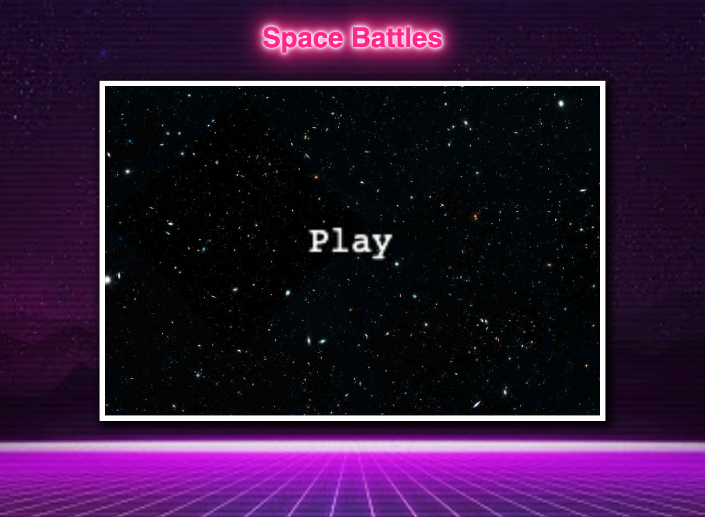
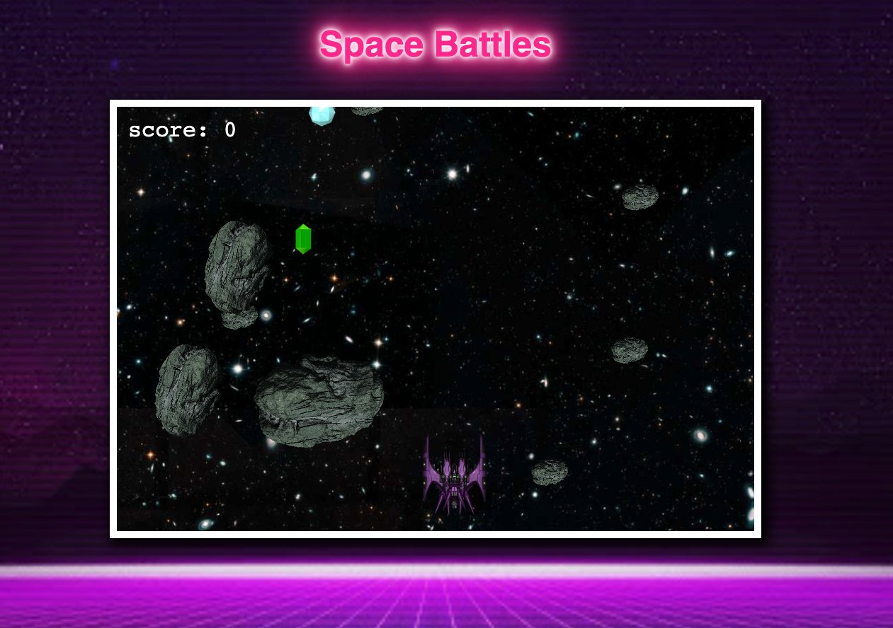

# SPACE BATTLES

This game was created for a project at General Assembly Sydney. It was made with Phaser3, Nodejs, HTML and CSS.

The aim of the game is to collect as many gems as you can without being struck by an asteroid.

### Playing the game

Click to play and it moves onto the game scene.

The arrow keys control the direction that the ship goes(up, down, right, left). The space bar fires bullets.

## Challenges

When creating an event that needs to be happen/change during the game my first instinct was always to put it in the update() function of phaser. This usually created an infinite loop so I've had to go back to each event and call the functions in a slightly different way to suit the scenario.

## Bugs

If you keep the space bar pressed down the frame
rate starts to get slower.
Because the createBullet is being called in update() an infinite loop is being created while the space bar is pressed down. And because the bullets aren't destroyed it creates a lag,

## Future Plan

After the ship has collected a certain amount of points an enemy ship will appear. The ship will need to beat the enemy to win the game.

### Links

[SPACE BATTLES](https://staceybros.github.io/SpaceBattles/)

[Phaser 3 examples](https://phaser.io/examples)

[Phaser GitHub](https://github.com/photonstorm)

[Phaser 3 Tutorials - Willam Clarkson](https://www.youtube.com/channel/UCnw4nJg3VWgXz6itvH8NkgQ)

[Phaser 3 Tutorials with Nodejs- Mitchell Hudson](https://www.youtube.com/c/MitchellHudson/videos)
